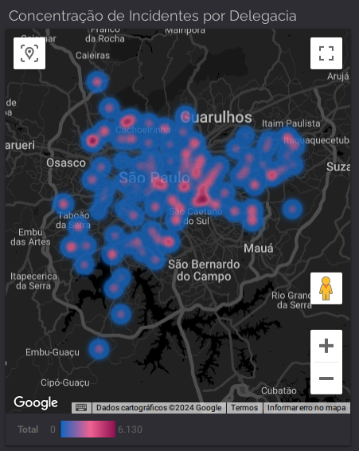
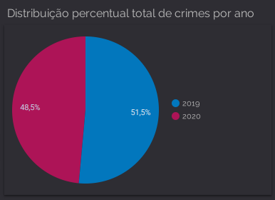
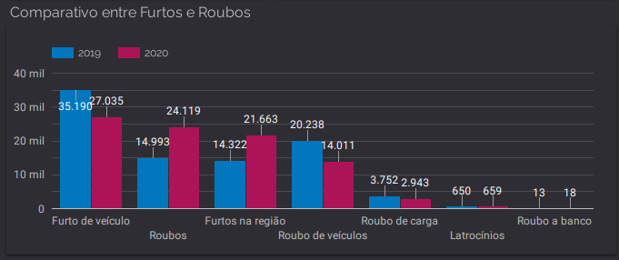
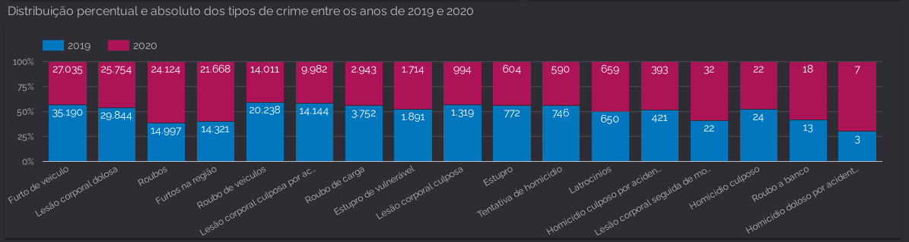
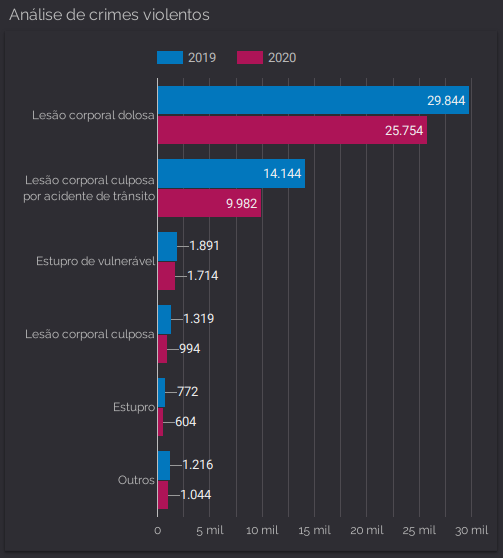

# 3º Projeto Prático - Trilha de dados
Projeto desenvolvido para o programa Desenvolve Boticário 2024  
Naíme Aiub Virmond

## Análise de Dados com `BigQuery` e `Looker` e `Storytelling`
### Estudo de caso: Análise de dados de crimes ocorridos em São Paulo entre 2019 e 2020

## Desafio
Realize uma análise de dados de crimes ocorridos em São Paulo usando o `BigQuery` para consultas e o `Looker` para visualização e geração de relatórios. Ao final, você deverá ter aprendido a criar consultas SQL complexas, criar painéis interativos e apresentar insights de dados.

## Etapas
- Importação de Dados: Importe conjuntos de dados deste <a href="https://drive.google.com/file/d/1sg97M1e2ESLQj7NFmodU4qqd6gLUT8gF/view?usp=sharing">link </a>
para o `BigQuery`.
- Consultas SQL: Escreva consultas SQL avançadas para extrair informações específicas dos dados.
- Criação de Painéis: Use o `Looker` para criar painéis interativos que apresentem visualizações de dados.
- Narrativa: Crie uma narrativa coesa que guie o leitor ou espectador através dos insights e conclusões.
- Apresentação: Apresente a história de dados de forma convincente, seja por meio de um relatório, apresentação ou visualização interativa.

## Para o projeto desenvolvido no `Looker`, acesse: <a href="https://lookerstudio.google.com/s/gDDtt6aPCgs">3º Projeto Prático - Dados </a>

### Descrição da Base de Dados:  

A base de dados cobre o período de janeiro de 2019 a dezembro de 2020 e contém informações detalhadas sobre crimes registrados em São Paulo. Os dados são organizados por delegacia e incluem uma variedade de tipos de crimes, oferecendo uma visão abrangente da criminalidade na região.

#### Principais Características da Base de Dados:

- Período de Tempo: Ano de 2019 e 2020.
- Delegacias: Inclui registros de diversas delegacias ao longo da cidade.
- Tipos de Crimes: Abrange vários tipos de delitos, como furtos, roubos, homicídios e crimes sexuais.

#### Estrutura dos Dados:

- Delegacia: Nome da delegacia responsável pelo registro do crime.
- Furtos na região: Número de furtos ocorridos na região.
- Roubo de carga: Número de roubos de carga.
- Roubos: Total de roubos registrados.
- Roubo de Veículo: Número de roubos de veículos.
- Furto de veículo: Número de furtos de veículos.
- Latrocínios: Número de latrocínios (roubos seguidos de morte).
- Homicídio doloso por acidente de trânsito: Número de homicídios dolosos resultantes de acidentes de trânsito.
- Homicídio Culposo por acidente de trânsito: Número de homicídios culposos resultantes de acidentes de trânsito.
- Homicídio Culposo: Número total de homicídios culposos.
- Tentativa de Homicídio: Número de tentativas de homicídio.
- Lesão Corporal seguida de morte: Número de casos de lesão corporal que resultaram em morte.
- Lesão Corporal Dolosa: Número de lesões corporais dolosas.
- Lesão Corporal Culposa por acidente de trânsito: Número de lesões corporais culposas resultantes de acidentes de trânsito.
- Lesão Corporal Culposa: Número total de lesões corporais culposas.
- Estupro: Número de casos de estupro.
- Estupro de vulnerável: Número de casos de estupro de vulneráveis.
- Roubo de veículos: Número de roubos de veículos.
- Roubo a Banco: Número de roubos a bancos.
- Ano: Ano do registro do crime.

### Base de dados de localização:

Para desenvolvimento do mapa de calor e outros insights de localização, foi gerado um arquivo KML no `Google Earth` com todos os pontos geoespaciais das delegacias e depois processado no `QGIS`, e como resultado um arquivo CSV com as seguintes colunas:

- nome: Nome da delegacia.
- longitude: ponto geoespacial de longitude.
- latitude: ponto geoespacial de latitude.

## Consultas SQL no `BigQuery`
### Consulta: p3_Furtos e Roubos, <a href="https://github.com/naimeaiub/Analise-de-dados-crimes-em-SP/blob/main/Cod_sql/p3_Furtos%20e%20Roubos.sql">link</a>.

### Consulta: p3_Crimes violentos, <a href="https://github.com/naimeaiub/Analise-de-dados-crimes-em-SP/blob/main/Cod_sql/p3_Crimes%20violentos.sql">link</a>.

### Consulta: p3_Total de incidente por delegacia, <a href="https://github.com/naimeaiub/Analise-de-dados-crimes-em-SP/blob/main/Cod_sql/p3_Total%20de%20incidente%20por%20delegacia.sql">link</a>.

## Paineis Desenvolvidos:  
- Concentração de Incidentes por Delegacia (mapa de calor interativo);
- Distribuição percentual total de crimes por ano (gráfico de pizza);
- Comparativo entre Furtos e Roubos (gráfico de colunas);
- Distribuição percentual e absoluto dos tipos de crime entre os anos de 2019 e 2020 (gráfico de colunas empilhadas);
- Análise de crimes violentos (gráfico de barras);

####  Todos os paineis são interatvivos com filtros de ano, tipos de crime e/ou delegacia.

## Para o projeto desenvolvido no `Looker`, acesse: <a href="https://lookerstudio.google.com/s/gDDtt6aPCgs">3º Projeto Prático - Dados </a>